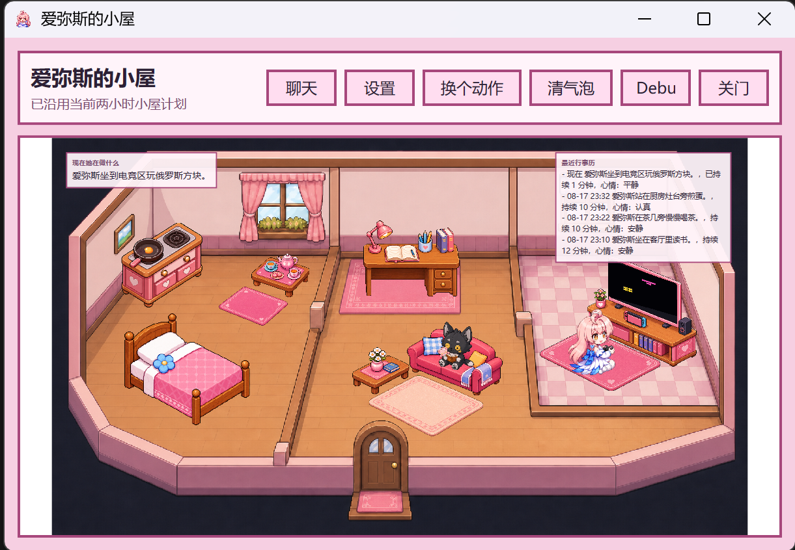
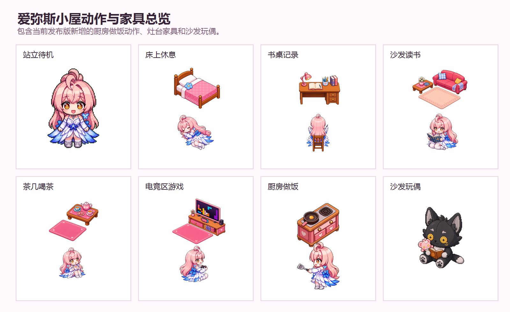
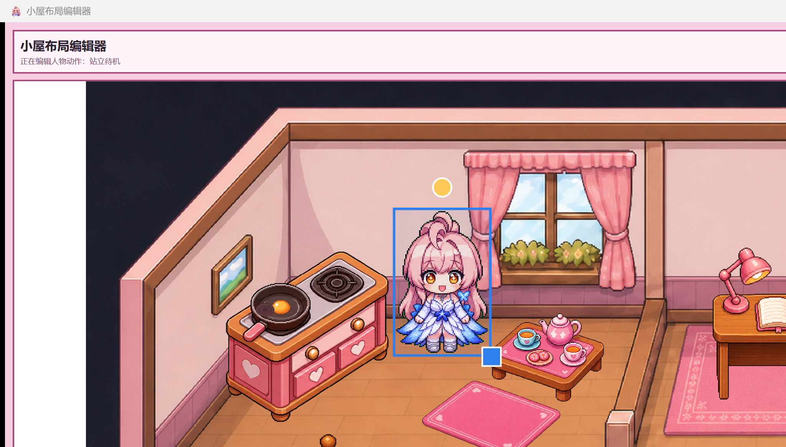

<p align="center">
  
</p>

<h1 align="center">DockPetWin Aemeath</h1>

<p align="center">
  让爱弥斯住进 PC 桌面，也住进自己的小屋。
</p>

<p align="center">
  
  
  
  
  
</p>

DockPetWin Aemeath 是一个本地优先的 Windows 桌面陪伴应用。爱弥斯会在桌面边缘休息、散步、回应提醒、和你聊天；打开小屋后，她也会按自己的行事历读书、写字、喝茶、游戏或做饭。当前主版本为 Windows，macOS 目录仅保留后续适配占位。

本项目基于 [DockCat](https://github.com/Auwuua/DockCat) 的桌宠概念与 Windows 移植版本继续开发，并加入了爱弥斯角色、人设资料、小屋系统、AI 对话、长期记忆、提醒任务、小屋布局编辑器和后台行事历。

内置角色“爱弥斯”是基于《鸣潮》相关角色与世界观制作的非官方同人桌宠版本。为了尽量还原她的口吻、关系感和拉海洛 / 索拉里斯相关背景，项目内置整理了约 69 个角色与世界观文本文件，合计约 63 万字符资料，用于 AI 对话时检索、约束人设和补充背景。

> 本仓库是源码开放的非商业分享版本，许可证沿用 PolyForm Noncommercial License 1.0.0。可以学习、修改和非商业分发；不能用于商业销售、收费分发或商业产品捆绑。

## 预览

| 桌面陪伴 | 爱弥斯的小屋 | 动作池与家具 | QQ 音乐唱歌 |
| --- | --- | --- | --- |
|  |  |  |  |
| 在桌面边缘休息、散步、被拖动，也会用气泡回应提醒。 | 小屋会保留约两小时行事历，关闭窗口后主应用仍会在后台推进计划。 | 读书、写小纸条、喝茶、睡觉、游戏、做饭、灶台和沙发玩偶等素材可以持续扩展。 | 检测到 QQ 音乐实际播放时，爱弥斯会停止散步并进入唱歌动作。 |

## 快速使用

推荐下载发布页中的平台压缩包。普通用户只需要下载自己系统对应的 release，不需要下载源码包。

### Windows

1. 下载最新的 DockPetWin Aemeath 压缩包。
2. 完整解压到桌面、下载、文档等当前用户有写入权限的位置。
3. 运行 `爱弥斯启动器.exe`。
4. 如果 Windows SmartScreen 提示未知发布者，确认来源后选择继续运行。
5. 第一次使用 AI 聊天时，根据爱弥斯的提示进入设置页填写 DeepSeek API Key。
6. 需要调整小屋家具或动作点位时，运行 `爱弥斯小屋编辑器.exe`。

不要把软件放进 `Program Files` 这类通常需要管理员权限的目录。DockPetWin 会在程序同目录写入 `UserData`，目录无写入权限会导致设置或记忆保存失败。

### macOS

本次发布只保留 `mac/` 空目录作为后续适配占位，不提供可运行的 macOS 应用包。旧 README 中的 macOS 移植说明会等后续重新产出 Mac 包时再恢复和更新。

后续如果恢复 macOS 包，会继续尽量沿用同一套爱弥斯资料、资源和干净 `UserData` 模板。

## 功能

### 桌面陪伴

- 爱弥斯会在桌面边缘休息、散步、做过渡动作。
- 可以用鼠标拖动她到喜欢的位置。
- 右键点击爱弥斯或系统托盘图标，可以打开聊天、小屋、设置、隐藏、重启和退出等功能。

### 两种 AI 对话

- `沉浸聊天`：以爱弥斯的角色关系、人设语气和世界观资料为核心，适合日常陪伴与角色向交流。
- `工具办事`：保留角色口吻，但用于文件、知识资料、提醒和任务工具等实际操作。
- 沉浸聊天可以在 `UserData/Agents` 的受限资料区读写当前对话需要的文件；不会执行提醒、联网搜索、手动记忆写入或外部技能。
- 涉及世界观硬事实时，爱弥斯会优先依赖已加载资料或本轮检索结果；允许自然延展感受和日常细节，但不会把没有依据的地点、剧情、物品用途或关系当成既有设定。
- 支持 DeepSeek 兼容接口；可选配置 Tavily API 执行联网搜索任务。

### 记忆与聊天归档

- 每条对话都会保存在本地聊天归档中；稳定的喜好、习惯和重要信息会作为独立记忆记录管理。
- 稳定用户档案会参与每次沉浸聊天；过去对话与长期记忆仅在用户明确询问以前聊过什么、记不记得某件事时按相关性读取，避免把旧事硬塞进当前回答。
- 聊天窗口的“清除对话”只重置当前上下文，不会删除长期记忆或本地归档。

### QQ 音乐唱歌动作

- 设置中默认开启“检测到 QQ 音乐播放时进入唱歌动作”。
- QQ 音乐存在活跃音频会话时，爱弥斯会停止散步并进入唱歌动画；暂停或停止播放后回到原本状态。
- 没有唱歌帧的自定义资源包会回退到对话姿态与轻微摆动，不影响正常使用。

### 小屋生活

- 首次打开小屋时，应用会规划接下来约两小时的生活安排。
- 关闭小屋窗口后，只要主应用仍在运行，约两小时行事历仍会在后台推进文字进度。
- 当前常见动作包括床上休息、书桌写小纸条、沙发旁地毯读书、茶几喝茶、电竞区玩游戏、厨房做饭。
- 厨房灶台默认显示普通家具图；爱弥斯触发做饭动作时，会切到煎蛋状态和做饭动作。
- 沙发区域新增玩偶素材，可以和其他家具一样随布局配置调整。
- 人物点位和家具点位可通过小屋布局编辑器或 `UserData\Home` 下的本地配置覆盖，方便用户自己微调。

### 小屋布局编辑器

- 单独运行 `爱弥斯小屋编辑器.exe` 即可进入编辑器，不会加载 AI 对话。
- 编辑器把人物动作和家具物品分开选择，避免混在同一个列表里。
- 选中元素后可以拖拽位置、调整大小和旋转；保存后写入 `UserData\Home`。
- 主应用小屋读取同一份配置，方便把编辑器里调好的动作点位同步到正式小屋。

<p align="center">
  
</p>

### 提醒与任务

- 支持间隔、每日、每周、每月提醒。
- 提醒可以只是弹出提示，也可以让爱弥斯按任务说明执行。
- 提醒配置保存在本地 `UserData`，更新软件时可以继续保留。

## API 配置

压缩包不会包含任何人的 API Key。新用户需要在设置里自行填写：

- `DeepSeek API Key`：用于爱弥斯的 AI 对话。申请地址：[https://platform.deepseek.com/usage](https://platform.deepseek.com/usage)
- `API Base URL`：默认使用 DeepSeek 兼容地址；如果你使用兼容服务，可以按服务商说明修改。
- `Model`：填写要调用的模型名。
- `Tavily API Key`：可选，用于联网搜索任务。不填写也能正常进行普通对话。申请地址：[https://app.tavily.com/home](https://app.tavily.com/home)

## 更新版本并保留 UserData

`UserData` 是最重要的本地数据目录，里面通常包含：

- `settings.json`：显示、称呼、资源包、提醒等偏好设置。
- `Agents`：聊天归档、原子长期记忆、角色资料、任务工作区。
- `AssetPacks`：爱弥斯资源包和用户自定义资源包。
- `Home`：小屋人物点位、家具点位和本地覆盖配置。

更新软件时，只要保留旧的 `UserData`，聊天、记忆、API Key 和偏好设置就不会丢。

推荐更新方式：

1. 先从菜单退出正在运行的桌宠。
2. 复制旧版本文件夹中的 `UserData` 做备份。
3. 解压新版到一个新文件夹。
4. 把旧版本的 `UserData` 复制到新版文件夹中。
5. Windows 运行新版 `爱弥斯启动器.exe`。

如果拿到的是不含 `UserData` 的更新包，也可以直接覆盖旧程序文件；覆盖前仍建议备份一次 `UserData`。只有想恢复全新初始状态时，才删除或重命名 `UserData`。

## 资源包

用户资源包位于：

```text
UserData\AssetPacks
```

分享版默认会带爱弥斯资源包，并在 `settings.json` 中选中它。首次启动时，程序也会准备默认参考资源：

- `default-lizz`：DockCat 默认栗子资源包参考。
- `huihui-pet`：示例资源包。
- `my-pet`：空模板资源包。

完整资源包格式见 [ASSET_PACK_GUIDE.md](ASSET_PACK_GUIDE.md)。

## 从源码运行

环境要求：

- Windows 10 或 Windows 11
- .NET 8 SDK

从源码运行：

```powershell
dotnet run --project .\DockPetWin\DockPetWin.csproj
```

构建：

```powershell
dotnet build .\DockPetWin\DockPetWin.csproj
```

生成便携式发布包：

```powershell
.\scripts\publish-win.ps1
```

生成面向新用户的分享包：

```powershell
.\scripts\make-share-package.ps1
```

分享包会生成自包含 Windows 可执行文件，并创建干净的首次使用 `UserData`：保留爱弥斯人设、世界观、必要技能和角色资源，但不包含个人聊天记录、个人称呼、私有记忆或 API Key。

本次 release 的 `mac/` 目录仅作占位，不提供可运行 macOS 包；如果后续恢复 macOS 适配，会在源码和说明中单独标注。

## 项目结构

```text
DockPetWin-main
├─ DockPetWin              # WPF 主应用
│  ├─ Core                 # AI、记忆、任务、小屋等核心逻辑
│  ├─ Resources            # 默认内置资源
│  └─ UI                   # 设置、聊天、小屋等界面相关代码
├─ Launcher                # 中文启动器和小屋编辑器启动入口
├─ docs/images             # README 展示图片
├─ scripts                 # 构建、发布、分享包脚本
├─ README.md
├─ ASSET_PACK_GUIDE.md
└─ LICENSE
```

## 隐私说明

DockPetWin Aemeath 是本地优先的桌面应用。设置、聊天归档、长期记忆、小屋记录和资源包默认保存在本机 `UserData` 中。

需要注意：

- 使用 AI 对话时，聊天内容会发送到你配置的 AI API 服务。
- 使用联网搜索时，搜索问题会发送到你配置的 Tavily 服务。
- 发布包不应包含个人 API Key、私人聊天、私人记忆、个人称呼或本地任务输出。
- 对外分享前，请使用 `scripts\make-share-package.ps1` 生成干净分享包。

## 许可证

DockPetWin Aemeath 沿用上游 DockCat 的 PolyForm Noncommercial License 1.0.0。完整条款见 [LICENSE](LICENSE)。

简要说明：

- 可以阅读、复制、修改和非商业分发。
- 不可以商业销售、收费分发、商业产品捆绑或用于商业服务。
- 如果公开分发修改版本，请保留许可证、上游 DockCat 链接和修改说明。

## 致谢

感谢 [DockCat](https://github.com/Auwuua/DockCat) 作者创造了原始桌宠体验。DockPetWin Aemeath 在此基础上继续扩展 Windows 桌面陪伴、小屋生活与 AI 角色互动。

内置 agent 的工作流、终端式任务执行思路和部分 TUI 交互设计参考了 [DeepSeek TUI](https://github.com/DeepSeek-TUI/DeepSeek-TUI) 这类开源 agent 项目。感谢相关开源实现提供的结构启发。
